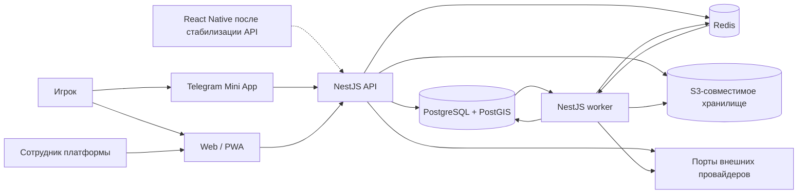
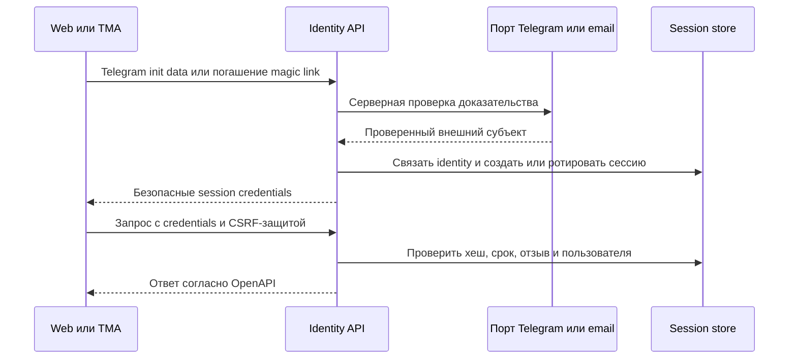

# Базовая архитектура

Этот документ задаёт правила платформы до появления продуктового кода. Предметные модули уточняют свои поля,
контракты и инварианты в соответствующих вертикальных промптах, не меняя описанные здесь направления зависимостей.

## Принципы

- Backend остаётся модульным монолитом: один репозиторий и одна схема развёртывания, но явные границы модулей и
  владения данными.
- TypeSpec — редактируемый источник истины для REST и детерминированно генерирует OpenAPI; AsyncAPI — источник
  истины для WebSocket и событий. Клиенты не определяют контракт по реализации backend.
- Синхронный запрос изменяет только данные, необходимые для атомарного результата. Необязательные внешние эффекты
  запускаются через транзакционный outbox после фиксации изменения.
- Внешние системы доступны только через порты. Выбор конкретного провайдера требует отдельной проверки условий,
  лицензии, стоимости и размещения данных.
- Production-процессы с персональными данными, включая наблюдаемость и резервные копии, размещаются в России с
  учётом результата юридической проверки до публичного запуска.

## Контейнеры и процессы

- `frontend/web` — отдельное React-приложение, устанавливаемая PWA и место административного интерфейса.
- `frontend/tg` — отдельное React-приложение Telegram Mini App. Оно не доверяет данным инициализации до ответа
  backend и не содержит альтернативной реализации бизнес-правил.
- `backend` собирает один модульный монолит NestJS с двумя режимами запуска: HTTP/WebSocket API и worker. Они
  используют одни прикладные модули, но масштабируются и завершаются независимо.
- PostgreSQL/PostGIS — источник истины для транзакционных и географических данных. Redis не является источником
  истины: он обслуживает BullMQ, распределённые ограничения частоты и короткоживущие технические данные.
- Объектное хранилище подключается только для функций с медиа. Пока такая функция не реализована, его отсутствие
  не маскируется фиктивным успешным адаптером.
- Reverse proxy, CDN, поставщики почты, Telegram, карт, геокодинга, аналитики и наблюдаемости остаются ролями, а не
  выбранными продуктами. Их выбор не входит в этот этап.

### Foundation-поставка и проверки

- Default-профиль `docker-compose.yml` содержит только локальные PostgreSQL/PostGIS и Redis. Профиль `foundation`
  добавляет одноразовый migration job, API, worker, web/PWA и TMA; API и worker не запускаются до успешного
  завершения миграций и готовности обязательных хранилищ.
- Backend Dockerfile имеет отдельный migration target с Prisma CLI. Runtime target не содержит dev dependencies и
  не получает право самовольно изменять схему при старте приложения.
- API и worker используют один runtime image и разные команды. Для API определён readiness healthcheck; worker
  проверяется по успешному запуску процесса и корректной обработке сигнала остановки до появления отдельного
  операционного health endpoint.
- Web и TMA собираются независимо и обслуживаются непривилегированным nginx на порту `8080`. Их контейнерные
  healthcheck проверяют статическую оболочку; это не выдаётся за доступность backend или внешнего провайдера.
- `scripts/check-workspaces.mjs` исполняет правила ADR 0003: единственный root lockfile, обязательные root/Turbo и
  workspace tasks, направление внутренних зависимостей и запрет backend/platform imports из общих пакетов.
- GitHub Actions выполняет независимые quality, backend integration и полный Compose smoke jobs на Node.js 22.
  Точный локальный и CI runbook находится в [документе эксплуатации](operations.md).

## Границы backend

### Слои модуля

Каждый предметный модуль имеет публичный прикладной интерфейс и внутренние слои:

1. `presentation`: HTTP-контроллеры, WebSocket-шлюзы, проверка формы входных данных и преобразование ошибок;
2. `application`: сценарии использования, авторизация, границы транзакций и идемпотентность;
3. `domain`: агрегаты, политики, значения и доменные события без NestJS, Prisma и SDK провайдеров;
4. `infrastructure`: Prisma-репозитории, очередь, часы, генераторы идентификаторов и адаптеры внешних портов.

Зависимости направлены от `presentation` и `infrastructure` к `application`/`domain`. Домен не импортирует NestJS,
Prisma, BullMQ, HTTP-клиенты или соседний модуль. Контроллеры и шлюзы не обращаются к Prisma напрямую.

### Владение и взаимодействие модулей

- Модуль владеет своими таблицами и изменяет их только через собственные прикладные сценарии.
- Синхронный вызов соседнего модуля допускается только через его экспортированный application-port, когда ответ
  нужен для текущего решения. Импорт внутренних репозиториев и циклические зависимости запрещены.
- Побочные реакции и распространение уже принятого решения выполняются версионируемыми событиями через outbox.
- Общая инфраструктура предоставляет транзакции, конфигурацию, наблюдаемость и доставку событий, но не содержит
  предметных правил.
- Транзакция, затрагивающая данные нескольких модулей, должна иметь одного владельца use case и быть явно
  описана в требованиях функции. Распределённых транзакций нет.

Начальный состав границ: `identity`, `profiles`, `venues`, `matches`, `communications`, `trust-safety`,
`administration`; будущие `clubs`, `tournaments`, `gamification`, `content`, `advertising`. Будущая граница — не
разрешение создавать её код заранее.

### Граница площадок и provider adapters

`venues` владеет canonical данными площадок, PostGIS queries, кандидатами, ревизиями, provenance, moderation
state и merge aliases. `matches` может ссылаться на опубликованный venue или ограниченный match-only candidate и
идемпотентно сообщает о подтверждённом завершении; он не меняет публикацию и не копирует координаты. Будущий
`clubs` связывается с venues отдельной необязательной таблицей, не владеет их жизненным циклом и не вводит
обязательность связи ни с одной стороны.

Внешняя география разделена на ports с разными правами: catalog seed/import, text geocoding, tiles и source
refresh/removal. Адаптер возвращает не только normalized result, но и provenance envelope и проверенные
capabilities показа, cache и хранения конкретных полей. Application layer отказывается сохранять результат без
`storageAllowed` и policy version; provider DTO/raw response не проходит в доменную модель, outbox или логи.
Конкретный поставщик не выбирается до review условий и residency. Production-конфигурация fail-closed, а mock
adapter доступен только local/test и не может сообщать ложный внешний успех.

Каталог PostgreSQL остаётся доступен при сбое геокодера или tiles. Синхронный provider вызов имеет ограниченный
budget/circuit breaker и не повторяет небезопасную мутацию; import/refresh используют bounded jobs с checkpoint,
идемпотентностью source version и quarantine. Удалённый upstream source создаёт состояние review, а не каскадное
удаление venue. Публикация, merge/alias, audit и outbox выполняются одной транзакцией. Privacy quarantine после
жалобы инвалидирует публичные caches только после commit и закрывает выдачу при cache miss из PostgreSQL.

### Граница матчей

`matches` владеет агрегатом матча, командами, участниками/гостями, заявками, FIFO-очередью, capability links,
результатом и immutable metric marker. `profiles` предоставляет актуальный уровень и публичную проекцию через
application port; `venues` разрешает canonical/alias/candidate и privacy state. Эти снимки не становятся
владением matches. Communications, statistics и trust/safety потребляют committed events асинхронно и не меняют
таблицы matches напрямую; moderator resolution вызывается отдельным авторизованным application use case.

Все меняющие вместимость операции сериализуются по match/version в PostgreSQL. Ограничения базы запрещают
переполнение команды и одновременную активную заявку/очередь/участие одного игрока. Освобождение места и
promotion/offer — одна транзакция с неизменяемой FIFO sequence; Redis не является арбитром. Подтверждение
результата атомарно создаёт согласованные состояния match/result, metric marker, audit и outbox. Уникальность
marker и idempotency record защищает повтор HTTP, worker и moderator resolution.

Поиск использует параметризованный PostGIS port venues и версионируемую rule-based scoring policy после hard
filters. Search origin не записывается в домен. `UNLISTED` исключён из обычной read model и открывается по token
не менее 128 бит, хранимому только как keyed hash; raw capability не проходит в логи, очереди или события.
Booking note — непроверенное заявление организатора, не provider integration. Встроенных бронирования, оплаты,
повторения расписания и автоматического подтверждения результата нет.

### Граница communications

`communications` владеет chat stream, revisions/tombstones, read positions, пользовательскими блокировками,
in-app inbox, preferences и delivery attempts. `matches` остаётся источником состава и lifecycle; committed match
events строят локальную access/system-event projection, а application port используется для fail-closed проверки
при lag или чувствительной операции. `trust-safety` позднее получает отдельный зашифрованный evidence record, не
читает общий чат произвольно. `identity` раскрывает проверенный адрес/Telegram subject только адаптеру конкретной
разрешённой доставки и не копирует contact в notification/outbox.

PostgreSQL назначает sequence и хранит источник истины. REST отдаёт snapshot, backward pages и forward catch-up;
WebSocket после одноразового ticket только ускоряет fan-out, сохраняет at-least-once semantics и требует
дедупликации/resync. Revoke membership/block change инвалидирует grant. Bounded per-connection queue, размер
payload и rate limits защищают от медленного клиента; отключение возвращает безопасную причину и REST cursor.

Fan-out создаёт уникальный in-app item и отдельные channel deliveries по preferences/quiet hours. BullMQ retry и
provider failover не входят в доменную транзакцию матча и не обещают exactly-once. Scheduler хранит UTC `notBefore`,
но вычисляет его из locale/IANA timezone policy. Адаптеры рендерят allowlisted шаблоны; событие нового сообщения не
несёт preview текста. Один внешний канал не подменяется другим без явного выбора пользователя. Production
адаптер/резерв запрещён до review условий, РФ-размещения, tracking, suppression, retention и idempotency.

### Граница trust/safety

`trust-safety` владеет lifecycle сигнала/case/decision/appeal, назначением, encrypted evidence и перестраиваемой
репутацией. Она не становится общей базой контента: matches, venues и communications сохраняют authoritative
объект и отдают точную revision через узкий авторизованный port. Исходные события несут opaque ID и category;
consumer перечитывает source и eligibility, поэтому outbox/DLQ не содержат жалобу или текст пострадавшего.

Игровой API видит только собственную receipt/status projection. Restricted repository требует assignment,
moderator role и отсутствия конфликта интересов на каждый read/write; break-glass выдаётся на один case и срок.
Решение создаёт идемпотентный effect через owning-module port после commit/outbox: no-show обновляет profile source,
result correction создаёт новую match revision, venue action остаётся в venues, content restriction — в source
module. Повтор, reversal и replay не умножают effect. Недоступность проекции/аналитики не блокирует обязательный
приём сигнала, блок или audit; недоступность authoritative owner оставляет effect pending, а не изображает успех.

Блокировки остаются в communications как единый safety preference store. Остальные модули проверяют
двусторонний deny синхронно для нового direct interaction и повторно перед commit; кеш может ускорить отрицательный
результат, но при lag/failure чувствительная мутация закрывается. Существующий общий матч использует ограниченную
проекцию и не разрушается блокировкой.

### Граница administration

`administration` владеет platform-role grants, отдельными admin sessions, адресными break-glass grants и
идемпотентными квитанциями координации. Он не является универсальным data access layer: user lookup, safety case,
venue decision и audit search вызывают узкие application-ports владельцев, повторяющие авторизацию на чтении и
изменении. Прямые Prisma imports между модулями, wildcard `SUPERADMIN` bypass и копирование restricted data в
admin read store запрещены. Мутация authoritative объекта, effect/outbox и audit остаётся одной транзакцией
владеющего модуля; сбой обязательного audit откатывает её.

Web admin использует отдельный route tree и server session audience. TMA и player web bundles не получают admin
routes или capability из скрытого client flag. Backend проверяет active role, capability, purpose, session epoch,
fresh re-auth, assignment/conflict и target revision независимо от UI. Подписанные cursors связаны с actor и query
scope. CMS/advertising подключатся позже через собственные ports; резервирование ролей не создаёт сейчас их экраны,
API или хранилища.

### Граница клубов

Модуль `clubs` владеет клубом, scoped membership/role, заявками, приглашениями, club block, связью с публичными
площадками и правилами повторения. Он не копирует identity/profile, координаты площадки, roster/result матча или
будущий tournament bracket. Авторизация сначала получает actor из `identity`, затем проверяет активный scoped role
по club ID; platform roles не преобразуются в `OWNER`/`ADMIN`, а club roles не проходят administration ports.

`clubs` проверяет публичную canonical площадку через read-port `venues` и хранит только venue ID. Merge/deletion
приходит минимальным версионированным событием: связь разрешается в survivor либо скрывается, а зависимое правило
серии приостанавливается. Модуль не меняет venue и не удаляет его при unlink. Клуб может существовать без связей.

Создание клубного или recurring матча вызывает application-port `matches` с реальным user-organizer и club
attribution. Возвращённый match ID/occurrence key хранится для идемпотентности генерации; membership или шаблон не
копируются в roster. Lifecycle, вместимость, очередь, чат и результат остаются за `matches`. Подтверждённый outcome
возвращается событием для метрики клуба. Будущий `tournaments` аналогично принимает club attribution и organizer
через отдельный port после этапа 10; прямых записей в его таблицы сейчас нет.

Передача ownership, membership transition, решение заявки, принятие приглашения, исключение/block, archive и
материализация позиции серии сериализуются в PostgreSQL. Domain change, обязательный минимальный audit и outbox
фиксируются атомарно. Worker генерирует только bounded horizon и не создаёт backlog после pause/archive; Redis/
BullMQ ускоряет планирование, но не определяет уникальность occurrence или наличие владельца.

### Граница турниров

Модуль `tournaments` владеет lifecycle турнира, scoped roles, entry/waitlist/check-in/payment-status, immutable
strategy snapshot, seed/lot, stages, rounds, tournament matches, standings и corrections. Он получает actor из
`identity`, public profile projection через read-port, canonical venue через `venues` и необязательную club
attribution через авторизованный `clubs` command-port. Club/platform/match roles не преобразуются в tournament
role; после создания только собственная scoped role и ownership определяют управление.

Обычный `matches` не является storage для bracket nodes: tournament match не наследует public join, match queue,
guest placeholder, chat lifecycle или organizer. После tournament completion минимальное versioned событие может
передать подтверждённый outcome в `profiles` через идемпотентный consumer, но не создаёт `CONFIRMED_MATCH` marker
обычного матча. Notifications получают только opaque tournament/recipient reference и template variables; состав,
payment state и точный результат не копируются в общий notification log.

Восемь strategy implementations — чистые allowlisted функции точной версии. Они читают только immutable snapshot,
ordered seed/lot и authoritative result revisions, а создаваемый граф защищён unique dependency/slot constraints.
PostgreSQL aggregate lock сериализует registration/promotion, seeding, result, correction и generation. Aggregate
change, обязательный audit, outbox и idempotent receipt коммитятся одной транзакцией; BullMQ lease не определяет
победителя или уникальность раунда.

Recovery worker воспроизводит projection и checksum из authoritative inputs. Расхождение, невозможный bracket,
неразрешённая ничья или winner-changing correction после старта зависимости переводят турнир в `PAUSED`; никакой
consumer не выбирает исход автоматически. Resume требует устранённой причины, повторной сверки и аудированного
решения organizer. Пользовательский DSL остаётся будущей отдельной границей и не подключается к runtime presets.

## Общие frontend-пакеты

React Native/Expo использует общие API-типы, domain, validation, i18n и analytics taxonomy, но имеет собственные
navigation, UI, secure storage, lifecycle, cache, deep-link и push adapters. DOM/browser cookie, Telegram WebApp и
web service-worker abstractions не импортируются. Архитектурная граница и выявленные contract gates описаны в
[требованиях mobile parity](mobile-parity-requirements.md). В частности, текущую browser-only refresh/CSRF модель
нельзя переносить через WebView cookie bridge: native credential protocol сначала определяется в TypeSpec и
security review.

Разрешены framework-neutral пакеты `api-client`, `domain`, `validation`, `i18n` и `analytics`. Они не импортируют
React, DOM, Telegram SDK, Expo/React Native и код приложений. `web` и `tg` могут зависеть от них; общие пакеты не
зависят от приложений или backend. UI, маршрутизация, состояние экрана и platform adapters принадлежат конкретному
клиенту. Полные правила зафиксированы в [ADR 0003](adr/0003-workspace-and-client-delivery.md).

## Аутентификация и сессии

- Клиент считается недоверенным. Только identity-модуль проверяет Telegram init data, погашает одноразовую
  magic-ссылку и связывает внешнюю identity с `User`.
- Направление сессий — короткоживущий access credential и ротируемый refresh credential. Refresh credential
  хранится на сервере только как криптографический хеш, имеет семейство ротации и отзыва; повторное применение
  отозванного значения отзывает семейство. Точные сроки фиксирует этап identity.
- Web и TMA держат access credential только в памяти и передают в заголовке авторизации, а refresh — в
  `Secure`, `HttpOnly`, ограниченной по области cookie. Изменяющие запросы дополнительно защищаются проверкой
  допустимого origin и CSRF-токеном. Правила сроков и ротации заданы в [требованиях identity](product-requirements.md).
- Будущий native-клиент использует тот же session use case, но передаёт credential из защищённого хранилища в
  заголовке авторизации; browser endpoint не выдаёт refresh в JSON. Отдельный native wire flow откладывается до
  этапа 14 и не является основанием реализовывать mobile сейчас. Полное решение зафиксировано в [ADR 0004](adr/0004-identity-credentials-and-proof-delivery.md).
- Выход, блокировка пользователя и чувствительное изменение identity отзывают подходящие сессии на backend.
  Авторизация ролей и ресурса выполняется в каждом application use case, а не только в guard или UI.
- Credentials и init data не передаются в URL, логи, трассировки, аналитику или WebSocket payload. Единственное
  исключение для доставки magic-ссылки — секрет во fragment доверенной landing page с немедленным удалением
  из адресной строки; ограничения описаны в [security/privacy](security-privacy.md).

## Потоки REST и WebSocket

### REST

1. Пограничный слой принимает только документированные media type, размер и метод, назначает `request_id` и
   продолжает либо создаёт `correlation_id`.
2. Аутентификация восстанавливает сессию, а application use case проверяет разрешение на конкретный ресурс.
3. Вход валидируется по контракту; повторяемая мутация использует idempotency key и хранит связанный результат.
4. Use case выполняет транзакцию PostgreSQL, включая доменную запись, outbox и при необходимости аудит.
5. После commit возвращается документированный ответ. Ошибки имеют стабильный код, безопасное сообщение и
   `request_id`; внутренние детали и персональные данные клиенту не выдаются.

### WebSocket

- Начальная авторизация использует короткоживущий одноразовый ticket, полученный через аутентифицированный REST;
  session credential и ticket не помещаются в URL. До успешной аутентификации подписки запрещены.
- Клиент подписывается только на разрешённые каналы. Проверка членства выполняется при подписке и повторяется при
  изменении прав или переподключении.
- Envelope, версия события, порядок в пределах потока, heartbeat, ошибки и правила возобновления описываются в
  AsyncAPI. Доставка как минимум однократная, поэтому клиент дедуплицирует событие по `event_id`.
- WebSocket ускоряет отображение, но не становится источником истины: после разрыва клиент получает актуальный
  снимок через REST, используя cursor/version из последнего принятого события.
- Текст чата и иные чувствительные payload не попадают в служебные логи. Backpressure ограничивает очередь
  соединения; медленный клиент отключается с документированной причиной и может восстановиться через REST.

## Транзакционный outbox

Доменная запись и `OutboxEvent` создаются одной транзакцией PostgreSQL. После commit отдельный dispatcher выбирает
необработанные события конкурентно и безопасно, публикует задание BullMQ и отмечает публикацию. Сбой Redis или
процесса после commit оставляет событие доступным для повтора и не откатывает доменное изменение.

Каждое событие имеет непрозрачный `event_id`, тип, версию схемы, время UTC, идентификаторы корреляции/причинности и
минимальный payload. Payload не содержит credentials и запрещённых для логов данных. Обработчик хранит или
проверяет `event_id` в своей границе и применяет эффект идемпотентно. Повторы используют ограниченную
экспоненциальную задержку с jitter; исчерпанные попытки переходят в карантин. Повторный запуск из карантина —
аудируемая административная операция, а не ручное изменение строки базы.

Порядок гарантируется только там, где контракт объявляет ключ потока/агрегата. Изменение схемы публикуется новой
совместимой версией; потребитель не должен зависеть от неизвестных полей.

Identity публикует минимальные события через внутренний канал `identity.events.v1`, описанный в AsyncAPI. Канал
не доступен WebSocket-клиентам; события не содержат email, Telegram subject, init data, magic URL или credentials.
Доставка magic email — исключение из обычного outbox-пути: raw одноразовый секрет передаётся adapter только в
памяти и не сохраняется для фонового retry, как определено в [ADR 0004](adr/0004-identity-credentials-and-proof-delivery.md).

## Обработка сбоев

| Сбой                             | Поведение                                                                                                                         | Восстановление                                                             |
| -------------------------------- | --------------------------------------------------------------------------------------------------------------------------------- | -------------------------------------------------------------------------- |
| PostgreSQL недоступен            | Readiness отрицательна, запросы данных завершаются безопасной временной ошибкой                                                   | Повтор после восстановления; незавершённая транзакция не считается успехом |
| Redis/BullMQ недоступен          | Readiness отрицательна; уже зафиксированная доменная транзакция сохраняется в outbox                                              | Dispatcher повторяет публикацию, когда Redis восстановлен                  |
| Внешний провайдер недоступен     | Ограниченный timeout/circuit breaker; критическая синхронная проверка завершается ошибкой, побочный эффект повторяется из очереди | Автоматический ограниченный retry либо аудируемый карантин                 |
| Worker завершён во время задания | Задание становится доступным повторно                                                                                             | Идемпотентный consumer продолжает по `event_id`                            |
| WebSocket разорван               | UI показывает потерю live-связи и не подтверждает мутацию без REST-ответа                                                         | Переподключение с backoff и синхронизация снимка через REST                |
| Неизвестная версия события       | Consumer не применяет событие и сигнализирует о несовместимости                                                                   | Исправление совместимости и контролируемый replay                          |

Timeout, retry и circuit breaker не складываются бесконтрольно: один use case имеет единый бюджет времени, а
повтор небезопасной мутации возможен только с идемпотентностью.

## Среды и конфигурация

| Среда        | Назначение и данные                                                          | Зависимости                                                                                              | Доставка и доступ                                                                  |
| ------------ | ---------------------------------------------------------------------------- | -------------------------------------------------------------------------------------------------------- | ---------------------------------------------------------------------------------- |
| `local`      | Разработка; только синтетические данные                                      | Docker Compose с PostgreSQL/PostGIS и Redis; внешние порты используют явно включённые локальные adapters | Ручной запуск, localhost, секреты вне Git                                          |
| `test`       | Unit/integration/contract/e2e в CI; одноразовые синтетические данные         | Изолированные версии обязательных сервисов, фиксированные часы и контролируемые adapters                 | Создаётся на job, уничтожается после неё                                           |
| `staging`    | Проверка release candidate; синтетические или необратимо обезличенные данные | Та же обязательная топология и миграции, что в production                                                | Ограниченный доступ команды, отдельные credentials и хранилища                     |
| `production` | Реальные пользователи и персональные данные                                  | Резервируемые PostgreSQL/PostGIS и Redis; только одобренные adapters                                     | Размещение данных в РФ после legal/security gate, least privilege, аудит изменений |

Конфигурация типизирована и полностью валидируется при старте. Неизвестные значения enum, пустые обязательные
секреты, тестовые credentials и небезопасные флаги останавливают запуск. Значения по умолчанию допустимы только
для `local`/`test`; production не понижает режим работы из-за отсутствующей конфигурации. Секреты приходят из
окружения или secret store, не имеют префикса для публичных frontend-переменных и никогда не встраиваются в bundle.
Каждая среда использует отдельные базу, Redis namespace, bucket, ключи и внешние приложения.

## Именование и время

- npm packages: `@picklehub/<имя>`; каталоги и package names — lowercase `kebab-case`.
- TypeScript: типы и классы `PascalCase`, функции и значения `camelCase`, константы `UPPER_SNAKE_CASE` только для
  действительно неизменяемых значений.
- PostgreSQL: таблицы, столбцы, индексы и ограничения `snake_case`; первичные ключи — непрозрачные идентификаторы,
  внешние ключи оканчиваются на `_id`. Имена миграций имеют UTC-префикс и краткое действие.
- REST paths — множественное число в `kebab-case` под `/v1`; JSON fields — `camelCase`. Имена операций OpenAPI
  стабильны и уникальны. WebSocket/event types — прошедшее действие с версией, например `match.created.v1`.
- Время хранится как timezone-aware UTC instant и передаётся в RFC 3339 с `Z`. Локальная дата/расписание хранит
  IANA timezone отдельно и отображается в часовом поясе пользователя.

## Миграции данных

- Prisma schema и migration files проходят review и хранятся в Git; `db push` и ручное изменение production-схемы
  запрещены. Сгенерировать миграцию можно только из проверенного изменения модели.
- CI поднимает пустую базу, применяет всю цепочку миграций и проверяет отсутствие schema drift. В production один
  выделенный release job применяет миграции до запуска зависящего от них кода; API replicas миграции не запускают.
- Production-миграции следуют expand/migrate/contract: сначала обратно совместимое добавление, затем безопасное
  дозаполнение наблюдаемыми пакетами, затем переключение кода и только в отдельном релизе удаление старой формы.
- Каждая миграция имеет план влияния блокировок, дискового места, повтора и восстановления. Откат данных выполняется
  новой forward migration или восстановлением по проверенной процедуре, а не редактированием применённой миграции.
- PostGIS extension включается миграцией с проверенными правами. Географические поля имеют SRID и ограничения,
  заданные контрактом функции; координаты не заменяются двумя неограниченными числовыми столбцами.

## Сгенерированный код

- Редактируются только TypeSpec, AsyncAPI и конфигурация генератора. Сгенерированные OpenAPI, API clients,
  transport types и файлы Prisma имеют заголовок или документированное происхождение и вручную не меняются.
- Генератор и его версия фиксируются root lockfile. Результат детерминирован, форматируется отдельно от ручного
  кода и хранится в Git, чтобы contract diff был виден в review и установка не требовала скрытой генерации.
- CI сначала валидирует контракт и совместимость, затем регенерирует artifacts и требует чистый diff. Изменение
  контракта и обновлённый generated output входят в один commit.
- Приложения импортируют REST API только через `@picklehub/api-client`; копии DTO и ручные правки generated files
  запрещены. Domain types используются лишь для понятий, которые не являются wire contract.

## Определение готовности

Изменение готово, когда одновременно выполнены следующие условия:

- требования и при необходимости ADR обновлены до контракта и кода; область работ не расширена молча;
- форматирование, Markdown links, lint, strict typecheck, относящиеся unit/integration/e2e tests, проверка
  OpenAPI/AsyncAPI, детерминированная генерация и build успешны для всех затронутых workspace;
- миграции применяются с нуля и не создают drift; конкурентные инварианты имеют проверку на уровне базы и тест;
- добавлены безопасные loading/empty/error/offline/success состояния затронутого UI и keyboard/accessibility
  checks, если UI входит в этап;
- конфигурация валидируется, логи и ошибки проходят redaction tests, liveness/readiness отражают обязательные
  зависимости, а метрики/alerts покрывают новый критический путь;
- security/privacy review проверил классификацию данных, срок хранения, rate limit, аудит и права доступа;
- точные команды и фактические результаты, изменённые файлы, решения, риски и следующий prompt записаны в
  [журнал AI-разработки](ai-development-log.md).

Для завершения всей основы платформы пустые backend, web/PWA и TMA должны устанавливаться единым root lockfile,
проходить корневые проверки, собираться и запускаться в документированной локальной среде; generated API client
должен воспроизводиться из контрактов, PWA shell — открываться без сети, а readiness — различать исправные и
неисправные обязательные зависимости. Это проверяется только на этапе `05-verification`, а не считается
выполненным данным архитектурным документом.

## Направление зависимостей геймификации

`gamification` — downstream consumer подтверждённых фактов `matches`, `tournaments`, `profiles`, `clubs` и
`trust-safety`. Owning-модули не зависят от XP и не вызывают его синхронно для успешного результата. После commit
они публикуют минимальный versioned event через outbox; gamification идемпотентно применяет rule snapshot, cap и
append-only ledger. Сбой consumer оставляет награду отстающей/`PENDING`, но не откатывает игру, отзыв, membership
или opt-out.

Global и каждый club scope используют отдельные ledger/balance/season partitions. Club configuration обращается к
clubs только через port проверки active club role и lifecycle; она не копирует membership graph. Eligibility
source fact проверяется по club attribution и membership interval на occurredAt. Профиль предоставляет разрешённую
публичную projection только на чтении leaderboard; leaderboard consent не подменяется analytics consent.

PostgreSQL — источник ledger chain, caps, rule/season snapshots, consent revisions, review decisions, receipts и
outbox. Redis допустим для короткого projection cache и распределённого задания, но cache key включает scope,
season, viewer consent/block/restriction revision; общий публичный CDN cache запрещён. Worker пересчитывает balance,
achievement и leaderboard из ledger и fail-closed не публикует projection при checksum/invariant mismatch.

Антифрод получает минимальные server facts через отдельный port, возвращая hold/reason class, а human-impacting
решение остаётся в scoped moderation workflow с audit и appeal. Behavioral analytics получает только события
после отдельного consent и не служит источником XP, recovery или расследования. Точные TypeSpec/AsyncAPI, SQL
границы, payload allowlist и consumer retry определяются этапом `11-gamification/02-contract-data.md`.

## Контент и новости

Модуль `content-news` — отдельный bounded context модульного монолита. Он владеет source registry, ingest
candidates, article/revision/origin, taxonomy, publication decisions и bookmarks. Administration предоставляет
staff identity/capability и принимает минимальный audit; identity не получает текст или историю чтения. Reader API,
CMS commands, ingestion worker, search projection и scheduler входят через отдельные ports и не пишут таблицы друг
друга напрямую.

Каждый RSS/API provider реализуется адаптером закрытого allowlist. Адаптер получает versioned source policy и может
вернуть только разрешённые metadata/excerpt, checkpoint и технический outcome. Generic HTTP fetch произвольного URL,
HTML crawler, обход robots/auth/paywall и fallback scraping архитектурно отсутствуют. Источник выключен до legal/
security/privacy/commercial review; изменение условий переводит его в pause до новой версии policy.

PostgreSQL остаётся источником lifecycle, immutable revisions/origins, checklist, bookmarks, audit link и
publication pointer. BullMQ опрашивает источники и исполняет уже одобренное расписание at-least-once; source
checkpoint, candidate keys и publication decision обеспечивают идемпотентность. Redis/CDN/search — удаляемые
проекции. Они получают только `PUBLISHED`, а unpublish/takedown сначала закрывает authoritative public read и
отправляет versioned invalidation. При lag система fail-closed не выдаёт старое тело из общего кеша.

Поиск первой версии строится средствами PostgreSQL по активной локализованной revision; отдельного поискового
кластера нет. Search index не содержит draft, candidate, origin evidence или revision history. Object storage
принимает только редакционно одобренное media с rights metadata и immutable key; внешнее изображение нельзя
hotlink/copy без разрешения.

Preview отделён от публичного reader route и cache namespace, связан с staff session, capability и точной revision,
имеет короткий срок, `private, no-store` и `noindex`. SSR/web SEO строится только из публичной projection; TMA deep
link разрешается через canonical article identity. Events publication/unpublication не содержат body/title/URL.
Поведенческая аналитика получает только consented allowlisted buckets и не участвует в выдаче или recovery.

Точные TypeSpec/AsyncAPI, SQL constraints, content sanitizer, adapter protocol, TTL и event payload принадлежат
этапу `12-content-news/02-contract-data.md`; этот этап не выбирает внешние источники и не заявляет их разрешёнными.

## Реклама

`advertising` — отдельный bounded context с admin commands, decision service, first-party renderer contract,
measurement endpoint, reporting projection и scheduler/maintenance worker. Он читает staff capability через
administration port и только минимальные contextual projections через owning ports. Matches, profiles, content,
clubs, tournaments и venues не читают campaign state и не зависят от доступности рекламы.

PostgreSQL — источник campaign/creative/provider policy revisions, approval, hard budget, reservations, delivery
facts, cap state, fraud decision, audit link и operation receipts. Redis допустим для короткого pacing/frequency
cache, но не является источником cap или spend. Worker активирует только approved exact revision по UTC schedule,
освобождает истёкшие reservations и строит агрегаты идемпотентно. Outbox доставляется at-least-once; уникальные
delivery/fact keys не допускают второго impression/click/spend.

Placement registry и critical-state matrix поставляются кодом клиентов и сверяются с server policy. Decision API
возвращает no-ad быстро и без provider wait на критическом пути; creative media хранится в собственном проверенном
object storage/CDN namespace без third-party executable resource. Ошибка advertising, Redis, media, reporting или
provider не меняет результат продуктовой операции, не блокирует render и не вызывает бесконечный retry.

Внешняя сеть подключается только через versioned provider adapter после legal/security/privacy/commercial review.
Adapter deny-by-default, не получает raw request/IP/URL/identity/coordinate и не загружает SDK/iframe/pixel в
клиент. Если договорные или технические ограничения нельзя выразить общим policy, provider несовместим. Terms
expiry и emergency switch прекращают вызовы; direct/house/no-ad продолжают работать независимо.

Behavioral analytics получает consented coarse events отдельно от authoritative delivery/reporting. Rollout
использует placement-level holdout и emergency pause при ухудшении match-funnel, accessibility или performance
guardrail. Точные API, SQL constraints, provider protocol, cap key/TTL и event allowlist принадлежат
`13-advertising/02-contract-data.md`; этот этап не выбирает сеть и не включает SDK.
