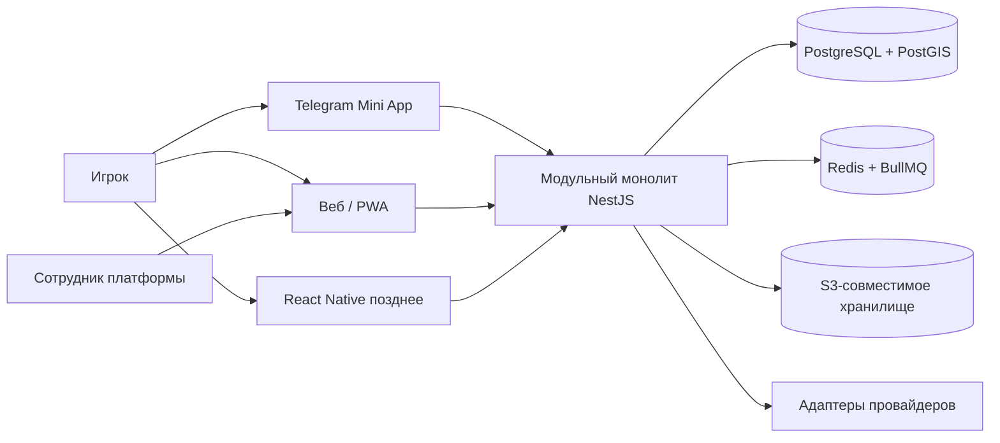

# Базовая архитектура

## Структура системы

## Границы

- HTTP-контроллеры и шлюзы WebSocket зависят от прикладных сценариев, а не напрямую от Prisma.
- Доменные модули отвечают за свои инварианты и публикуют версионируемые доменные события в транзакционный outbox.
- Диспетчеры outbox ставят задания в очередь только после фиксации транзакции в базе данных; потребители
  идемпотентны по идентификатору события.
- Интеграции скрыты за портами для Telegram, электронной почты, импорта OSM, геокодирования и карт, DUPR, рекламы,
  аналитики и объектного хранилища.
- `frontend/packages/api-client` генерируется из OpenAPI. Общие доменные вспомогательные функции не должны
  импортировать API браузера, Telegram или React Native.

Промпты функций должны дополнять этот документ контейнерами, зависимостями модулей, потоками данных, сценариями
сбоев и топологией развёртывания.
