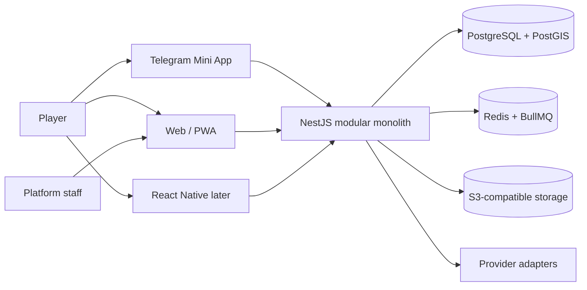

# Architecture baseline

## System shape

## Boundaries

- HTTP controllers and WebSocket gateways depend on application use cases, not Prisma directly.
- Domain modules own their invariants and publish versioned domain events into the transactional outbox.
- Outbox dispatchers enqueue jobs only after database commit; consumers are idempotent by event ID.
- Integrations live behind ports for Telegram, email, OSM/import, geocoding/maps, DUPR, advertising, analytics and object storage.
- `frontend/packages/api-client` is generated from OpenAPI. Shared domain helpers must not import browser, Telegram or React Native APIs.

Feature prompts must refine this document with containers, module dependencies, data flow, failure modes and deployment topology.
